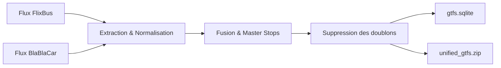

<p align="center">
  
</p>

<h1 align="center">Linia</h1>

<p align="center">
  <strong>Planificateur d'itinéraires et cartographie unifiée des réseaux de bus longue distance en Europe.</strong>
</p>

<p align="center">
  <a href="https://liniabus.eu"></a>
  
  
  
  
  
</p>

---

## Sommaire
- [Description du Projet](#description-du-projet)
- [Fonctionnalités](#fonctionnalités)
- [Architecture Technique](#architecture-technique)
- [Pipeline de Traitement GTFS](#pipeline-de-traitement-gtfs)
- [API REST](#api-rest)
- [Installation et Utilisation](#installation-et-utilisation)
- [Déploiement Docker](#déploiement-docker)
- [Configuration](#configuration)
- [Sources des Données](#sources-des-données)
- [Licence](#licence)

---

## Description du Projet

Linia agrège et cartographie l'ensemble des lignes d'autocars longue distance en Europe à partir des flux de données ouverts (GTFS) de **FlixBus** et **BlaBlaCar Bus**.

### Rôle de l'application
- **Vue consolidée du réseau** : Rassembler dans un graphe unique les réseaux de FlixBus et BlaBlaCar Bus.
- **Simplification géographique** : Regrouper les multiples gares et arrêts physiques d'une même métropole sous une entité urbaine unique (*Master Stop*) pour clarifier la lecture des trajets.
- **Planification directe** : Identifier immédiatement toutes les liaisons directes sans correspondance au départ d'une ville.
- **Distribution Open Data** : Générer une archive GTFS standardisée et unifiée téléchargeable pour les développeurs et analystes.

---

## Fonctionnalités

- **Carte interactive (Leaflet)** : Tracé vectoriel précis des lignes réelles (*shapes*) et positionnement des gares routières.
- **Moteur de recherche d'arrêts** : Autocomplétion tolérante aux fautes, gestion des accents et support des synonymes internationaux (ex. *Praha / Prague*, *München / Munich*).
- **Regroupement d'arrêts (*Master Stops*)** : Consolidation des arrêts secondaires (ex. *Bercy Seine*, *La Défense*, *Orly*) sous l'arrêt principal de la métropole.
- **Internationalisation SSR (30 langues)** : Traduction complète de l'interface, gestion des slugs traduits par pays et balises SEO (`hreflang`, Open Graph, canonical).
- **Export Open Data** : Téléchargement direct d'une archive GTFS unifiée (`unified_gtfs.zip`) et d'une base SQLite optimisée.
- **Zéro framework JS lourd** : Conçu en Vanilla JavaScript et CSS sur-mesure pour un chargement immédiat et une empreinte minimale.

---

## Architecture Technique

```
Navigateur (Vanilla JS, Leaflet)
       │
       ▼  HTTP / API REST
Serveur Flask (app.py)
  ├── Rendu SSR Jinja2
  ├── Sécurité CSP (Talisman) & Limiteur de requêtes
  └── Cache mémoire (Flask-Caching)
       │
       ▼  Requêtes SQL pré-indexées
Base de données SQLite (output_gtfs/unified/gtfs.sqlite)
       ▲
       │  Compilation périodique
Pipeline ETL (build_gtfs.py)
  ├── Téléchargement GTFS (data.gouv.fr)
  ├── Normalisation des identifiants (FLX-, BLA-)
  └── Dédoublonnage et compression
```

### Composants
| Composant | Technologie | Rôle |
| :--- | :--- | :--- |
| **Serveur web** | Python 3, Flask 3.1 | Routage, SSR, endpoints API et gestion de session |
| **Base de données** | SQLite3 | Stockage relationnel pré-indexé et requêtage rapide |
| **Traitement de données** | Pandas, NumPy | Pipeline ETL d'extraction, fusion et nettoyage GTFS |
| **Interface** | HTML5, CSS3, Vanilla JS | Affichage réactif sans dépendances externes lourdes |
| **Cartographie** | Leaflet 1.9 | Moteur cartographique et rendu des couches vectorielles |
| **Sécurité** | Flask-Talisman, Limiter | En-têtes CSP stricts, protection XSS et rate limiting |
| **Serveur de production** | Gunicorn | Serveur WSGI |

---

## Pipeline de Traitement GTFS

Le script `build_gtfs.py` met à jour les données à intervalles réguliers :



1. **Téléchargement** des flux officiels depuis `data.gouv.fr`.
2. **Préfixage des identifiants** (`FLX-` pour FlixBus, `BLA-` pour BlaBlaCar Bus) pour éviter les collisions d'ID.
3. **Agrégation urbaine** des arrêts d'une même agglomération.
4. **Suppression des doublons** et calcul des correspondances.
5. **Génération** de la base SQLite indexée et de l'archive ZIP GTFS téléchargeable.

---

## API REST

| Endpoint | Méthode | Paramètres | Description |
| :--- | :---: | :--- | :--- |
| `/api/search_stops` | `GET` | `q` (texte) | Recherche d'arrêts et de villes avec support des synonymes |
| `/api/connected_stops` | `GET` | `stop_id` (string) | Liste des villes reliées en direct depuis cet arrêt |
| `/api/trip_details` | `GET` | `trip_id` (string) | Tracé géométrique complet (`shapes`) et arrêts desservis |
| `/download/unified_gtfs.zip` | `GET` | — | Téléchargement de l'archive GTFS unifiée |

---

## Installation et Utilisation

### Prérequis
- Python 3.10 ou supérieur
- pip

### 1. Installation
```bash
git clone https://github.com/votre-compte/linia.git
cd linia
python3 -m venv venv
source venv/bin/activate
pip install -r requirements.txt
```

### 2. Génération de la base de données
```bash
python3 build_gtfs.py
```

### 3. Lancement du serveur
```bash
python3 app.py
```
L'application est disponible sur `http://localhost:5000`.

---

## Déploiement Docker

```bash
docker build -t linia .
docker run -d -p 5000:5000 --name linia-app linia
```

---

## Configuration

- `config_data.py` : Pôles majeurs (`TOP_HUBS`), slugs d'URL traduits (`URL_SLUGS`), synonymes de recherche (`SEARCH_SYNONYMS`).
- `translations.json` : Fichier unique des traductions de l'interface pour les 30 langues supportées.

---

## Sources des Données

- **FlixBus** : Données GTFS ouvertes publiées sur data.gouv.fr.
- **BlaBlaCar Bus** : Données GTFS ouvertes publiées sur data.gouv.fr.
- **Cartographie** : Tuiles et données géographiques OpenStreetMap.

---

## Licence

Projet sous licence libre. Les données GTFS sources restent la propriété de leurs opérateurs respectifs.
